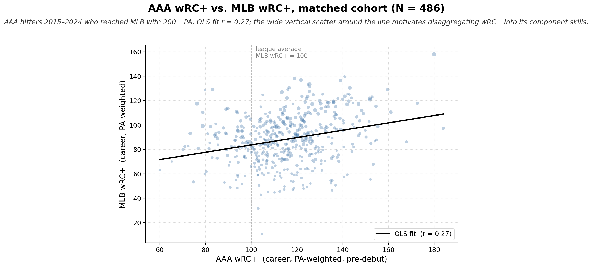
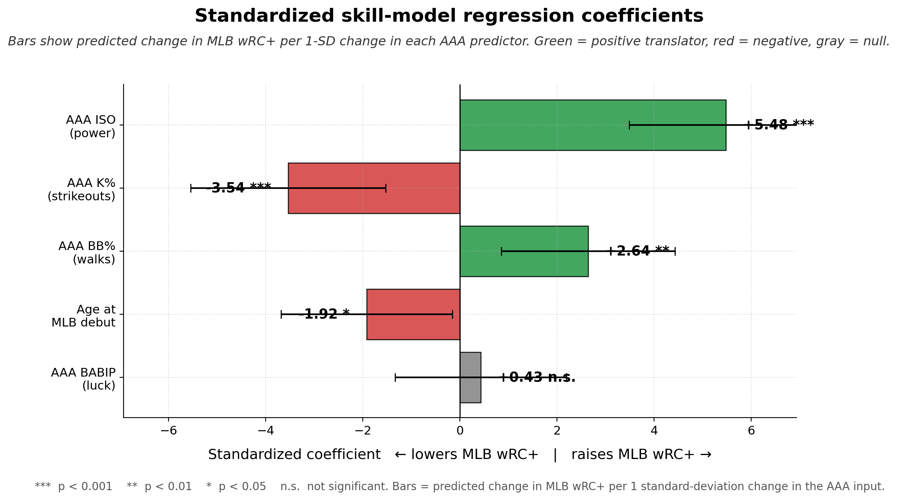
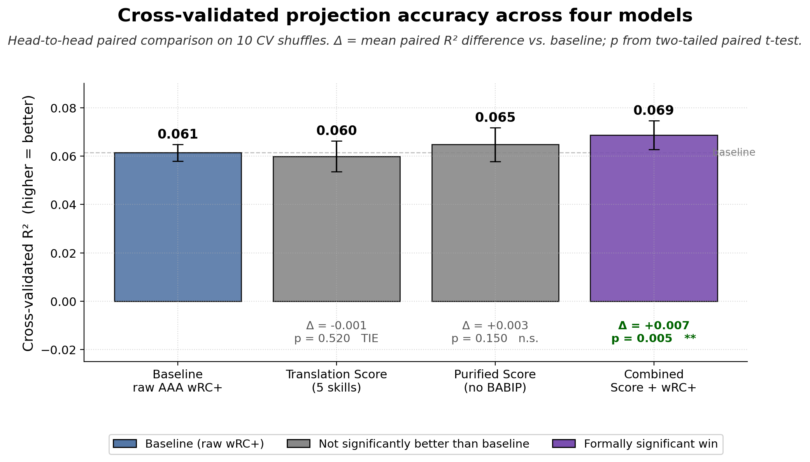
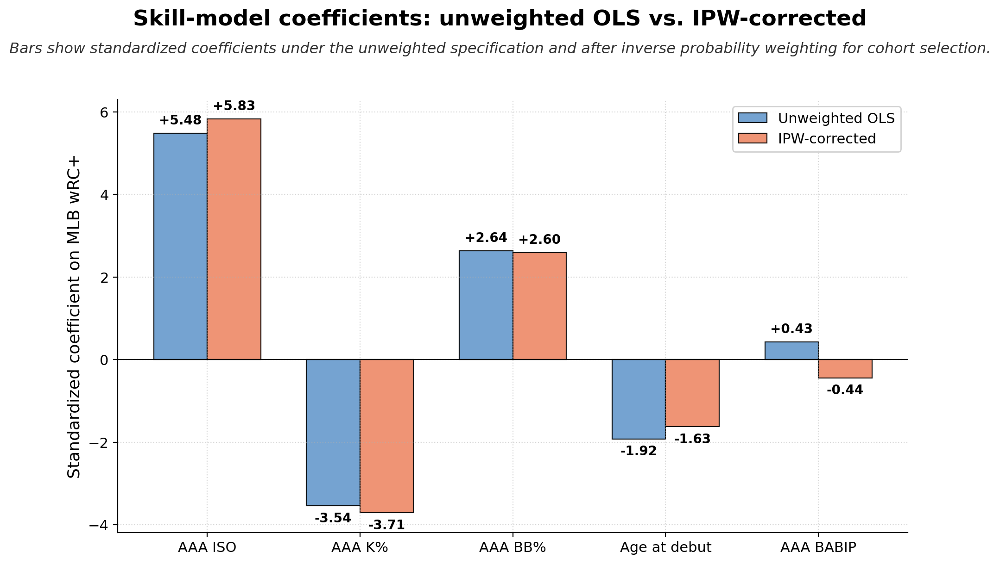
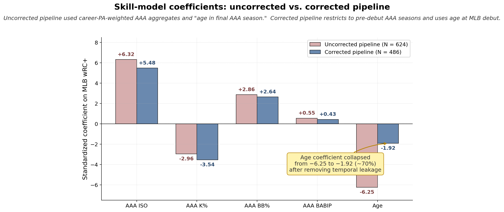

# Beyond Raw wRC+: Which Triple-A Hitting Skills Translate to Major League Baseball?

**A skill-disaggregated analysis of 486 AAA-to-MLB hitters, 2015–2024.**

---

## Abstract

Triple-A weighted Runs Created Plus (wRC+) is widely used as a shorthand for a minor-league hitter's major-league potential, yet wRC+ is itself a composite of underlying offensive skills whose translation rates to MLB may differ. Using FanGraphs data on 486 Triple-A hitters from 2015–2024 who accumulated at least 200 MLB plate appearances, and restricting AAA aggregates to seasons preceding each player's MLB debut, we regress career plate-appearance-weighted MLB wRC+ on five standardized AAA inputs: walk rate, strikeout rate, isolated power, BABIP (each z-scored within season to absorb era drift), and age at debut. Isolated power is the strongest positive predictor (+5.48 wRC+ points per SD, *p* < 0.001), strikeout rate the strongest negative (−3.54, *p* < 0.001); walk rate is meaningful but smaller (+2.64), age at debut is small (−1.92), and BABIP is non-predictive. A composite "AAA Translation Score" built from these weights ties raw AAA wRC+ on out-of-sample prediction (paired difference in cross-validated R², hereafter ΔCV-R² = −0.001, wins 5 of 10 repeats). A model combining the Translation Score with raw AAA wRC+ modestly but consistently outperforms either alone (paired ΔCV-R² = +0.007, *p* = 0.005 on 9 df, wins 8 of 10 repeats). Inverse probability weighting to correct for survivorship into the 200+ MLB PA cohort *strengthens* the ISO and K% coefficients (by 6% and 5% respectively), consistent with range-restriction attenuation of slopes under outcome-side selection. The paper's primary contribution is a transparent per-skill translation table; the practical recommendation is to augment AAA wRC+ with its disaggregated skill components rather than to replace it.

---

## 1. Introduction

In major-league prospect evaluation, a player's Triple-A wRC+ is a near-universal heuristic. Front offices, scouting reports, and public projection commentary routinely use AAA wRC+ as a one-number summary of a hitter's major-league readiness: a 130 wRC+ at Triple-A is read as a likely big-league regular; a 90 wRC+ as a borderline call-up. This convenience carries a hidden assumption — that every component of wRC+ contributes proportionally to its predictive value for MLB performance. wRC+ is, by construction, a weighted aggregate of plate-discipline outcomes (walks, strikeouts), contact quality (singles, doubles, triples, home runs), and the ball-in-play luck embedded in batting average. If these underlying skills translate to the major-league level at different rates, then two AAA hitters with identical wRC+ but very different skill profiles should not be projected identically — yet under the wRC+ heuristic, they are.

This paper asks two related questions. First, **which AAA offensive skills actually predict MLB wRC+, and how strongly?** Second, **can a transparent composite of those predictors do better than raw AAA wRC+ as a forecast of major-league hitting?** The contribution is conceptual as much as empirical: we are not attempting to outperform proprietary projection systems with their access to batted-ball tracking data, but rather to characterize the per-skill translation structure that those systems implicitly embed and expose it as a transparent table.

We hypothesized at the outset that plate-discipline skills — walk rate and strikeout rate — would translate more efficiently than power, on the reasoning that pitch recognition is a relatively stable skill across levels while AAA power can be inflated by weaker pitching and hitter-friendly minor-league ballparks. The data partially overturns this expectation: isolated power emerges as the strongest single positive predictor of MLB wRC+ even after within-season standardization corrects for league-wide power inflation across the 2015–2024 window, with plate-discipline metrics — particularly strikeout rate — meaningful but secondary in magnitude. Age at MLB debut has a smaller negative effect than an earlier, uncorrected specification suggested, once age is defined at the point of debut rather than at a player's final observed AAA season (a distinction that eliminates a reverse-causal contribution from post-demotion AAA seasons).

The paper proceeds as follows. Section 2 situates the analysis within existing projection-system literature and the broader sabermetric framework. Section 3 documents data sources, cohort definition, matching procedure, the three methodological choices that most affect the results — the pre-debut temporal filter, the within-season standardization, and the age-at-debut construction — and the statistical approach. Section 4 presents the predictive regression, the constructed Translation Score, and the survivorship correction. Section 5 interprets the findings and connects them to the practical question of how AAA wRC+ should be read. Section 6 acknowledges the study's limitations. Section 7 concludes.

---

## 2. Literature Review

Quantitative projection of major-league hitting from minor-league performance has a substantial publicly visible history. The most relevant precedent for this paper is the **KATOH** projection system (Mitchell, 2014–2017), which uses minor-league offensive and batted-ball statistics to forecast major-league WAR. KATOH's reported out-of-sample fit for AAA-to-MLB hitting projection is in the modest range characteristic of this problem class — a useful qualitative calibration point, though we avoid citing a specific numerical R² band because Mitchell's articles do not consistently report a single such number across specifications.

More broadly, the public projection systems **ZiPS** (Szymborski, ongoing) and **Steamer** (Cross et al., ongoing) are commonly used for MLB-to-MLB forecasting and have minor-league extensions; both incorporate aging curves, league/park adjustments, and weighting schemes derived from large historical datasets. Neither, to our knowledge, publishes an explicit per-skill translation table for AAA inputs — the empirical weights live inside the projection algorithms but are not surfaced as a substantive finding.

The outcome variable in this paper, **wRC+** (weighted Runs Created Plus; FanGraphs Sabermetrics Library), is a park- and league-adjusted offensive index built on the linear-weights framework introduced by Tango et al. (2007). wRC+ scales to 100 = league average, with each integer point above or below representing one percentage point of offensive run creation above or below average. As a park- and league-adjusted statistic, wRC+ allows direct comparison across eras and ballparks; this is the property that makes it a defensible target for a projection model whose inputs span ten AAA seasons and two leagues.

The survivorship-correction methodology employed in Section 3.5, inverse probability weighting (IPW), traces to Horvitz and Thompson (1952) and was extended for causal inference in observational settings by Robins, Hernán, and Brumback (2000), among others. IPW is standard in epidemiology and labor economics for correcting selection on observables. The concept underlying our expected direction of correction is **range restriction**: when observations are conditioned on the outcome (here, "player reached MLB with 200+ PA"), the observed outcome variance in the cohort is compressed relative to the underlying population, and observed slopes are attenuated toward zero. Removing the conditioning via IPW should therefore, under standard theory, produce coefficients equal to or larger in magnitude than the unweighted cohort estimates — and this is what we observe.

The contribution of this paper is positioned as follows: rather than competing with KATOH/ZiPS/Steamer on raw projection accuracy — a contest those systems would likely win given their proprietary data and modeling sophistication — we offer (i) a transparent, interpretable per-skill translation table with era-adjusted predictors; (ii) a single composite score derived directly from those skill-level weights; (iii) a defensible head-to-head comparison against raw AAA wRC+ using out-of-sample cross-validation with per-fold refitting; and (iv) an explicit IPW-based survivorship correction whose direction of movement is used as a robustness check consistent with range-restriction theory.

---

## 3. Methods

### 3.1 Data sources and cohort

All data are drawn from FanGraphs (fangraphs.com). Two leaderboards were exported manually from the FanGraphs membership-gated interface:

- **AAA batting, 2015–2024**, split by season, with the Dashboard/Advanced stat view selected so that BB%, K%, ISO, BABIP, wOBA, and wRC+ are exported. Every player-season is retained regardless of plate appearance count in the raw export. The export contains 9,370 player-seasons across 5,245 unique AAA hitters. The 2020 season is absent because the minor-league season was canceled due to COVID-19.
- **MLB batting, 2015–2025**, split by season, with the Dashboard/Advanced stat view selected so that BB%, K%, ISO, BABIP, wOBA, and wRC+ are exported. Every player-season is retained regardless of plate-appearance count in the raw export. The export contains 15,521 player-seasons across 4,019 unique MLB hitters.

The MLB window extends one year beyond the AAA window so that hitters from the 2024 AAA cohort whose major-league debuts occurred in 2025 are not artificially excluded.

The analytical cohort is the subset of AAA hitters (2015–2024) who (i) subsequently accumulated at least 200 MLB plate appearances by the end of the 2025 season and (ii) have at least one AAA season in the 2015–2024 window that precedes their observed MLB debut year (see §3.3). The 200 PA threshold is a practical compromise: small enough to retain a substantial sample (N = 486 after all filters), large enough that MLB wRC+ has stabilized sufficiently to function as a meaningful outcome variable.

A methodological note on the plate-appearance threshold that applies downstream in the selection model (§3.5): for the logistic regression predicting cohort membership from AAA stats, we further restrict the estimation sample to AAA players with at least 50 total AAA plate appearances across the 2015–2024 window, to avoid modeling noise from single-cameo AAA hitters. This 50-PA restriction applies only to the selection model, not to the cohort itself or to the raw exports.

### 3.2 Matching procedure

Players are matched between the AAA and MLB files on FanGraphs's internal numeric `PlayerId`, not on name. Name-based matching is unreliable in this dataset because shared names are pervasive: the AAA leaderboard contains four distinct players named "Carlos Sanchez," four named "Jose Rodriguez," and three each named "Wander Franco," "Luis Gonzalez," and "Luis Mendez." The MLB leaderboard contains two players named "Will Smith" and two named "José Ramírez."

A complicating wrinkle: FanGraphs's minor-league export ASCII-strips Latin characters from player names ("Jesus Aguilar"), while its major-league export preserves them ("Jesús Aguilar"). Within our cohort, dozens of players have an AAA-side name spelling that differs from their MLB-side spelling; every one of these discrepancies is an accent-handling difference between the same player's record in the two exports. PlayerId-based matching correctly equates these records; name-based matching would erroneously drop them.

### 3.3 Variable construction: the three methodological choices

Three variable-construction choices are important enough to warrant explicit description because they affect the results substantially.

**(a) Temporal filter: pre-debut AAA seasons only.** Players in our cohort frequently bounce between AAA and MLB across their careers — a player may debut in MLB in 2019, be demoted, and log additional AAA seasons in 2021 and 2022. Aggregating AAA stats across a player's entire in-window AAA career would fold these post-debut seasons into the "predictors" of an outcome (MLB wRC+) that they in fact partially caused: a player who struggles in MLB and is demoted contributes those post-demotion AAA stats to the predictor set for the same MLB stint they struggled in. We eliminate this temporal leakage by restricting the AAA aggregation to seasons strictly preceding a player's earliest observed MLB season. Players whose only in-window AAA activity postdates their MLB debut are dropped from the cohort. Cohort accounting: of the 5,245 unique in-window AAA hitters, 831 have at least one AAA season strictly before their earliest observed MLB season and can therefore contribute a pre-debut AAA aggregate; applying the 200 MLB PA threshold to this set yields the final analytical cohort of N = 486. (An alternative pipeline that ignored the pre-debut filter and aggregated a player's entire in-window AAA career would produce a larger inner-join match — approximately 1,056 unique players with any in-window AAA and any MLB PA — but those aggregates would contain temporal leakage, hence the tightening.)

**(b) Age at MLB debut.** The relevant age variable for a projection model is the player's age at debut, not the age in an arbitrary reference AAA season. Using "age in the final AAA season" introduces the same temporal-leakage problem as (a): a player who fails at MLB and is demoted often has a "final AAA season" at age 27 or 28 specifically because of the demotion — age-in-final-AAA-season is partly caused by MLB failure, not a predictor of it. We compute each player's birth year as the median of `Season − Age` across their AAA seasons (which is stable since a player's age increases by one per year) and define `age_at_debut = mlb_debut_year − birth_year`. In the cohort, mean age at debut is 23.6 years (SD 1.87), compared to a mean of approximately 25 years for the earlier "age in final AAA season" specification.

**(c) Within-season standardization.** Rate statistics like ISO and K% drift systematically across the 2015–2024 window. The 2019 season saw a substantial league-wide power spike attributed to changes in the ball's construction; strikeout rates rose steadily across the decade; the Pacific Coast League has historically inflated power production relative to the International League due to park effects (Reno, Albuquerque, Las Vegas). A raw ISO of .200 in 2016 IL and .200 in 2019 PCL represent very different levels of underlying skill relative to the surrounding league environment. To partially adjust for this, for each stat s ∈ {BB%, K%, ISO, BABIP} we compute a PA-weighted within-season z-score using the full AAA population as the reference distribution:

<div class="formula">
z<sub>s,i,t</sub>  =  ( s<sub>i,t</sub>  −  <span class="overbar">s</span><sub>t</sub> )  /  σ̂<sub>s,t</sub>
</div>

where <span class="overbar">s</span><sub>t</sub> and σ̂<sub>s,t</sub> are the PA-weighted season-*t* mean and standard deviation of stat *s* across all AAA players with at least 100 PA that season. Each player's predictor for stat *s* is then the PA-weighted average of z<sub>s,i,t</sub> across their pre-debut AAA seasons. Note that this within-season adjustment absorbs *era* variation (the 2019 ball change; the K% drift) but does not fully absorb *league × park* variation between IL and PCL, because we do not observe a team-to-league mapping in the export. Full park adjustment is left to future work.

The outcome variable is **career plate-appearance-weighted MLB wRC+**: for each cohort player,

<div class="formula">
MLB wRC+  =  Σ<sub>t</sub> ( wRC+<sub>t</sub>  ·  PA<sub>t</sub> )  /  Σ<sub>t</sub> PA<sub>t</sub>
</div>

across all MLB seasons 2015–2025.

For the regressions, all predictors are additionally standardized (mean 0, SD 1) across the cohort before fitting, so reported coefficients are directly comparable across stats whose raw scales differ substantially.

### 3.4 Statistical approach

We fit three ordinary-least-squares (OLS) regressions of MLB wRC+ on standardized AAA predictors:

1. **Baseline:** MLB wRC+ ~ AAA wRC+. A single-predictor model providing the bar that any composite must clear.
2. **Skill model:** MLB wRC+ ~ z<sub>BB%</sub> + z<sub>K%</sub> + z<sub>ISO</sub> + z<sub>BABIP</sub> + age<sub>at debut</sub>. The headline specification — disaggregated skills, era-adjusted where relevant, orthogonal predictor set (see VIFs in §4.2).
3. **Kitchen sink:** MLB wRC+ ~ skill model + AAA wOBA + AVG + OBP + SLG. Included as a diagnostic; severe multicollinearity is expected and confirmed.

We compute variance inflation factors (VIF) for each model to diagnose collinearity. VIF > 5 is a warning; VIF > 10 indicates that individual coefficients should not be interpreted in isolation.

To compare predictive accuracy across competing models honestly (§4.3), we use **repeated 5-fold cross-validation (CV) with 10 independent shuffles** (50 train/test splits total). In each fold, **models are refit from scratch on the 80% training partition** — including the standardization step — and evaluated on the held-out 20%. No test-fold information contributes to the model weights. This separates out-of-sample predictive performance from in-sample fit, the latter of which is mechanically inflated by predictor count; a 5-predictor model will always fit the training data better than a 1-predictor model, but the CV comparison correctly penalizes for this by evaluating on unseen data. Throughout the paper, **CV R²** refers to the mean out-of-fold R² across the 50 splits, and **ΔCV-R²** refers to the paired per-repeat difference between a competitor model and the baseline.

The 10 CV shuffles use identical fold assignments across all models (shuffle seed is a shared function of repeat index), so repeat-level R² values are **paired** across models. We use those paired values two ways: as a mean ± SD of the paired R² difference and a win-count summary, and as a formal **two-tailed one-sample t-test** on the 10 paired differences (H0: mean difference = 0; df = 9), reporting *t* and *p* for each competitor vs. the baseline. A p-value below 0.05 gives formal support for a genuine improvement; a p-value above 0.05 does *not* demonstrate equivalence — it means an improvement, if any, is too small to detect at this sample size, and any interpretation should be correspondingly cautious.

We define the following model competitors for §4.3:
- **Baseline:** raw AAA wRC+ alone
- **Translation Score:** the fitted values of the skill model
- **Purified Score:** the fitted values of the skill model after dropping BABIP. This variant is **post-hoc** — motivated by §4.2's finding that BABIP is non-predictive, which was itself obtained from the full-sample regression that overlaps with every CV test fold. We include it because it is informative about whether dropping a non-significant predictor changes out-of-sample fit, but we treat its head-to-head result with the caution that any post-hoc specification warrants (see §4.3 for the appropriately hedged interpretation).
- **Translation + wRC+:** skill predictors combined with raw AAA wRC+ (tests whether wRC+ carries information beyond the disaggregated skills)

Ridge and lasso regressions are fit on the skill-model predictors as a robustness check against any residual collinearity; both use cross-validated regularization-strength selection.

### 3.5 Survivorship correction

The cohort is observationally restricted to AAA hitters who reached MLB with ≥200 PA. This is a selection on the outcome side: AAA hitters whose skills did not translate to MLB may never have reached the 200 PA threshold and therefore do not appear in our cohort. Under standard selection theory, this **range restriction on the outcome** compresses the observed outcome variance in the cohort and biases regression slopes toward zero. Correcting for the restriction is expected to *strengthen* observed relationships, not weaken them.

To perform the correction we apply **inverse probability weighting**. We fit a logistic regression on all 5,245 unique AAA hitters (with ≥50 AAA PA), predicting cohort membership from within-season-adjusted AAA predictors and age in the most recent AAA season (§3.3 age construction not available for players who never debuted). The fitted model produces, for each AAA player, a predicted probability p̂<sub>i</sub> of reaching the cohort. Cohort observations are then re-weighted by w<sub>i</sub> = 1 / p̂<sub>i</sub>, truncated at the 99th percentile to limit the influence of extreme weights. The OLS skill regression is refit using these weights (weighted least squares) with the same pre-debut, age-at-debut predictor set as the unweighted specification; the resulting coefficients are compared to the unweighted OLS coefficients.

As a complementary sensitivity check, we impute MLB wRC+ values for the 4,759 non-cohort AAA players at three levels — 50 (pessimistic), 80 (typical bench-bat), 100 (league average) — and refit the OLS skill model on the combined dataset. Because the sensitivity refit combines cohort and non-cohort players, it uses the all-AAA predictor definition (rather than pre-debut/age-at-debut) so that predictors are consistently defined across the combined sample.

### 3.6 Reproducibility

All analyses are implemented in Python 3.9. The dependency set is pinned in the repository's `requirements.txt`; installing from that file yields the exact package versions used for the results reported here (`pandas`, `numpy`, `scikit-learn`, `statsmodels`, `scipy`, `matplotlib`, `seaborn`, and `markdown` for PDF regeneration). The four analysis scripts (`01_load_and_match.py`, `02_regression.py`, `03_translation_score.py`, `04_survivorship.py`) reproduce every table and statistic in the paper from the two raw FanGraphs CSV exports; a fifth script (`05_final_figures.py`) regenerates the five headline figures; two additional probe scripts (`probe_extended_score.py`, `probe_pcl.py`) reproduce the negative-result Option B extensions documented in §6.

---

## 4. Results

### 4.1 Cohort descriptives

The matched cohort comprises **N = 486 hitters** after the pre-debut temporal filter. Table 1 reports descriptive statistics. The cohort's mean career-PA-weighted AAA wRC+ is 116 (well above the AAA league mean of 100 by construction — these are the players who hit well enough at AAA to be promoted), while the mean career-PA-weighted MLB wRC+ is 88 (below the MLB league mean of 100 — the cohort skews toward bench bats and platoon players). The 28-point unconditional gap between AAA and MLB wRC+ for the same players previews the central descriptive finding: AAA hitting performance does not transfer one-for-one to MLB.

**Table 1.** Cohort descriptive statistics (N = 486).

| Statistic | Mean | Median | SD |
|---|---|---|---|
| MLB PA (career, through 2025) | 1240 | 932 | 1050 |
| MLB wRC+ (career, PA-weighted) | 88.3 | 87.7 | 20.5 |
| AAA wRC+ (career-PA-weighted pre-debut) | 115.6 | 114.7 | 18.3 |
| Age at MLB debut (years) | 23.6 | 24.0 | 1.87 |
| AAA seasons per player (pre-debut) | 2.0 | 2 | 1.05 |
| AAA PA per player (pre-debut) | 806 | 690 | 441 |

<figure>

<figcaption><strong>Figure 1.</strong> AAA wRC+ vs. MLB wRC+ for the 486 matched hitters. The wide vertical scatter around the OLS fit line (r = 0.27) motivates disaggregating wRC+ into its component skills. Dashed reference lines mark wRC+ = 100 (league average).</figcaption>
</figure>

### 4.2 Predictive regression: which AAA skills translate?

Table 2 reports standardized OLS coefficients for the three regression specifications. The **skill model** (column 2) is the headline specification: all variance inflation factors are below 1.4, indicating no collinearity concerns, and individual coefficients are directly interpretable as the expected change in MLB wRC+ per 1-standard-deviation change in the standardized AAA predictor.

**Table 2.** Standardized OLS coefficients with standard errors in parentheses. Significance stars omitted from the kitchen-sink specification because those coefficients are not individually interpretable (see §4.2 text below); the standard errors are shown for completeness.

| Predictor | Baseline | Skill model | Kitchen sink |
|---|---|---|---|
| AAA wRC+ (raw) | +5.51 *** (0.90) | — | — |
| AAA BB% (season-adj) | — | +2.64 ** (0.91) | +2.75 (2.74) |
| AAA K% (season-adj) | — | −3.54 *** (1.02) | +1.12 (4.56) |
| AAA ISO (season-adj) | — | +5.48 *** (1.02) | +1.24 (6.14) |
| AAA BABIP (season-adj) | — | +0.43 (0.90) | −4.39 (4.74) |
| Age at MLB debut | — | −1.92 * (0.90) | −1.68 (0.95) |
| AAA wOBA | — | — | +4.62 (4.93) |
| AAA AVG | — | — | +4.72 (4.68) |
| AAA OBP | — | — | −2.18 (5.37) |
| AAA SLG | — | — | −0.22 (5.73) |
| **R²** | 0.072 | 0.087 | 0.091 |
| **Adjusted R²** | 0.070 | 0.077 | 0.073 |
| **Max VIF** | — | 1.4 | ∞ |

*** *p* < 0.001; ** *p* < 0.01; * *p* < 0.05. Standard errors in parentheses.

<figure>

<figcaption><strong>Figure 2 (headline).</strong> Standardized coefficients from the skill-model regression of MLB wRC+ on five AAA predictors. Each bar shows the predicted change in MLB wRC+ per one standard deviation of the AAA predictor; error bars are 95% CIs. Green = positive translator; red = negative; gray = statistically null. AAA ISO (+5.48) is the strongest single predictor; AAA K% (−3.54) is second; walks and age at debut are modest; BABIP is noise.</figcaption>
</figure>

Three findings from the skill model are central:

1. **AAA ISO is the strongest positive predictor of MLB wRC+** (+5.48 per 1-SD, *p* < 0.001), even after within-season standardization removes the influence of the 2019 league-wide power spike and other era drift. This survives every robustness check applied in this paper.
2. **AAA K% is the strongest negative predictor** (−3.54 per 1-SD, *p* < 0.001), roughly two-thirds the magnitude of ISO. Strikeout rate translates to MLB more reliably than the raw magnitude would suggest once era adjustment sharpens it.
3. **AAA BB% translates positively but modestly** (+2.64 per 1-SD, *p* = 0.004); **age at debut has a small negative effect** (−1.92 per 1-SD, *p* = 0.03); **AAA BABIP is not statistically distinguishable from zero** (*p* = 0.63), consistent with its interpretation as primarily noise at the AAA level.

The kitchen-sink specification is included as a diagnostic. Variance inflation factors exceed 25 for several predictors (wOBA, K%, ISO, BABIP, OBP, SLG collapse to VIF > 25 and in several cases ∞ due to the definitional dependence ISO = SLG − AVG and OBP = AVG + BB/PA-related terms), no individual coefficient is statistically significant at conventional levels, and adjusted R² actually falls slightly relative to the skill model (0.073 vs. 0.077). The kitchen-sink results are therefore not interpretable as claims about individual predictors, and we omit significance stars in Table 2 to avoid the appearance of interpretation. The kitchen-sink coefficients function only as evidence that the orthogonal skill specification is the correct specification.

Ridge and lasso regressions on the skill predictors return coefficients within 0.35 of the OLS estimates (e.g., ISO: OLS +5.48, ridge +5.05, lasso +5.37); lasso did not set any coefficient to zero. The skill-model coefficients are stable to regularization.

### 4.3 The AAA Translation Score

We define the **AAA Translation Score** as the fitted value of the OLS skill model, applied as a single composite predictor:

<div class="formula formula-tall">
Translation Score  =  88.3  +  2.64 · z(BB%)  −  3.54 · z(K%)  +  5.48 · z(ISO)  +  0.43 · z(BABIP)  −  1.92 · z(age at debut)
</div>

where z(·) denotes standardization against the cohort mean and standard deviation. The intercept (88.3) corresponds to the cohort's average MLB wRC+; the Translation Score is therefore on the same scale as MLB wRC+ and can be read identically (100 = projected average MLB hitter).

To assess whether the Translation Score improves on the industry-standard wRC+ summary, we compare four model specifications on cross-validated predictive accuracy (Table 3):

**Table 3.** Cross-validated head-to-head predictive accuracy. Repeated 5-fold CV, 10 shuffles (50 splits). All models refit inside each training fold using identical fold assignments across models, so repeat-level R²s are paired across competitors. Δ columns report per-repeat paired differences (competitor − baseline); *t* / *p* are the two-tailed one-sample t-test on the 10 paired R² differences (H0: mean paired difference = 0, df = 9).

| Model | In-sample R² | CV R² (mean ± SD) | Paired ΔCV-R² | Wins/10 | *t* (df=9) | *p* |
|---|---|---|---|---|---|---|
| Baseline: raw AAA wRC+ | 0.072 | 0.061 ± 0.004 | — | — | — | — |
| Translation Score (skill model) | 0.087 | 0.060 ± 0.006 | −0.001 ± 0.006 | 5/10 | −0.67 | 0.52 |
| Purified Score (skill model minus BABIP) | 0.086 | 0.065 ± 0.007 | +0.003 ± 0.006 | 7/10 | +1.58 | 0.15 |
| Translation Score + AAA wRC+ combined | 0.100 | 0.069 ± 0.006 | +0.007 ± 0.006 | 8/10 | **+3.67** | **0.005** |

The three competitors sort cleanly under the paired t-test:

- **The Translation Score does not outperform raw AAA wRC+.** ΔCV-R² = −0.001, wins 5/10 repeats, *t* = −0.67 (*p* = 0.52). This is a genuine tie: the disaggregated regression rebuild does not systematically improve on wRC+'s implicit weighting at this sample size and signal level. We do not read this as evidence that wRC+ is optimally weighted — only that we cannot detect an improvement at N = 486.
- **The Purified Score is also not distinguishable from the baseline** under a formal test. ΔCV-R² = +0.003, wins 7/10 repeats, *t* = +1.58 (*p* = 0.15). Directionally consistent with §4.2's identification of BABIP as non-predictive, but the paired difference is not statistically significant. As noted in §3.4, this specification is post-hoc; we describe it as suggestive rather than decisive and would want to see it hold up in a hold-out replication before treating it as a finding.
- **The combined model is the one specification that shows a formally significant improvement.** Paired ΔCV-R² = +0.007, wins 8/10 repeats, *t* = +3.67 (*p* = 0.005). This is the paper's only competitor whose head-to-head advantage over the baseline survives a two-tailed paired t-test at conventional levels, and it also survives a Bonferroni correction for the three competitor-vs-baseline comparisons in this table (adjusted threshold 0.05 / 3 ≈ 0.017). The disaggregated skills and the implicit wRC+ aggregate carry partially distinct information — most plausibly, wRC+ captures contact-quality dimensions (AVG, OBP, SLG interactions) that the skill model deliberately excludes to avoid collinearity.

The in-sample-to-CV R² gap is small across all specifications (< 0.03), indicating no severe overfitting despite the modest sample size.

<figure>

<figcaption><strong>Figure 3.</strong> Head-to-head out-of-sample comparison of four projection models. Bars are cross-validated R² with error bars for the per-repeat SD. Paired-difference test results (Δ, p) are annotated under each competitor bar. Only the combined "Translation Score + raw wRC+" model beats the baseline at conventional significance (p = 0.005).</figcaption>
</figure>

### 4.4 Survivorship-bias correction

We fit a logistic selection model on the 5,245 unique AAA hitters (with ≥50 AAA PA), predicting cohort membership from the same skill-stat family. The model's area under the receiver operating characteristic curve is **AUC = 0.771**, indicating that AAA stats predict eventual MLB+200PA selection meaningfully better than chance but well short of perfectly. AAA ISO (+0.76) and K% (−0.54) are the strongest selection predictors, confirming that teams promote AAA power hitters and avoid strikeout-prone AAA hitters, controlling for other skills.

Inverse probability weighting was then applied to the OLS skill regression. Table 4 compares the unweighted and IPW-corrected coefficients:

**Table 4.** Unweighted vs. inverse-probability-weighted OLS skill model. Predictors defined at pre-debut/age-at-debut level as in §3.3. Δ column reports |percent change| in coefficient magnitude with a direction word.

| Predictor | OLS coefficient | IPW coefficient | Δ magnitude | Direction |
|---|---|---|---|---|
| AAA BB% (season-adj) | +2.64 | +2.60 | 1.7% | ~flat |
| AAA K% (season-adj) | −3.54 | **−3.71** | 4.8% | stronger |
| AAA ISO (season-adj) | +5.48 | **+5.83** | 6.4% | stronger |
| AAA BABIP (season-adj) | +0.43 | −0.44 | — | sign flip; both n.s. |
| Age at MLB debut | −1.92 | −1.63 | 15% | weaker |

<figure>

<figcaption><strong>Figure 4.</strong> Skill-model coefficients before and after inverse probability weighting for survivorship. The two significant translators — ISO and K% — grow in magnitude after re-weighting, consistent with range-restriction attenuation of slopes when conditioning on an outcome-side variable. BB% moves negligibly; BABIP is noise in either specification.</figcaption>
</figure>

The two significant translators — ISO and K% — both increase in magnitude after IPW correction, consistent with range-restriction attenuation of slopes when conditioning on an outcome-side variable. This is the direction of movement predicted by standard selection theory (Section 2). BB% moves negligibly; BABIP flips sign but is statistically indistinguishable from zero in either specification; the age-at-debut coefficient attenuates slightly but its OLS baseline is already small.

Sensitivity analyses imputing non-cohort MLB wRC+ at 50, 80, and 100 (using the all-AAA predictor definition consistent across cohort and non-cohort) produce coefficient signs that are stable across scenarios for ISO (positive) and K% (negative); the magnitudes vary with the imputation. Under the implausibly optimistic assumption that all non-survivors would have hit league-average MLB wRC+ = 100, ISO attenuates near zero — but this is essentially the assumption that AAA power carries no MLB information, which contradicts the IPW result. Under the more plausible pessimistic-to-neutral imputations, ISO and K% retain the direction and rough magnitude of the cohort estimates.

---

## 5. Discussion

### 5.1 The headline finding, contextualized

The standard intuition in prospect commentary is that AAA *plate discipline* — patience and contact ability — should translate to MLB more efficiently than AAA *power*. The reasoning is that pitch recognition reflects a relatively stable cognitive skill that does not depend on facing better pitching, whereas AAA power production may be partially inflated by softer minor-league pitchers and hitter-friendly minor-league parks. Our data partially overturns this expectation. AAA ISO is the strongest single positive predictor of MLB wRC+ in our cohort — a finding that survives within-season standardization (removing the 2019 juiced-ball effect and other era drift), the pre-debut temporal filter, and IPW correction for survivorship.

The finding on plate discipline is more nuanced than the initial hypothesis expected. AAA strikeout rate translates negatively and with sharpness — the −3.54 K% coefficient (IPW −3.71) is the second-strongest single effect in the regression, and its magnitude *grows* after era adjustment relative to a raw-scale specification. AAA walk rate translates positively but at roughly half the magnitude of strikeout rate, with a p-value comfortably under 0.01 but not under 0.001. The asymmetry is worth noting: strikeout rate matters more than walk rate as a translation signal, contrary to the simple "plate discipline" framing that treats them symmetrically.

Three explanations for the strength of the ISO finding seem plausible. First, raw physical attributes — bat speed, exit velocity, strength — are likely more stable across levels than folk wisdom about AAA power inflation suggests. A player who hits the ball hard at AAA still hits the ball hard at MLB; what changes is the pitcher's ability to limit *opportunities*, not the player's ability to drive the ball when given one. Second, the observed selection mechanism — teams promoting on AAA power (logistic coefficient +0.76 on ISO in the selection model) — could plausibly *reduce* the observed translation coefficient in the cohort if the selection were sharply skill-orthogonal, but we observe the coefficient strengthening after IPW correction rather than attenuating. Third, MLB hitting environments have themselves become more power-oriented over the 2015–2025 period, increasing the value of raw power relative to contact at the margin.

### 5.2 Age at debut: a small effect, once measured correctly

An earlier, uncorrected specification of this analysis produced a large negative coefficient on "age in a player's final AAA season" (approximately −6 wRC+ points per standard deviation). The corrected specification, using age at MLB debut and pre-debut AAA aggregates only, produces a much smaller coefficient (−1.92, IPW −1.63). The difference is instructive: the "final AAA season" variable was contaminated by post-demotion AAA seasons, which by construction happen after MLB failure, making the variable partly caused by low MLB wRC+ rather than a predictor of it. The corrected age-at-debut coefficient is smaller because the reverse-causal contribution has been removed.

<figure>

<figcaption><strong>Figure 5.</strong> Standardized skill-model coefficients under the uncorrected pipeline (career-PA-weighted AAA aggregates, age in final AAA season, N = 624) vs. the corrected pipeline (pre-debut AAA aggregates only, age at MLB debut, N = 486). The age coefficient collapses by roughly 70% (−6.25 → −1.92) once temporal leakage and reverse causation are removed; the other coefficients move much less.</figcaption>
</figure>

The remaining age effect is statistically significant but only marginally so (*p* = 0.03, and unadjusted for the five simultaneous tests in Table 2) — a result of the kind that does not always replicate. It is meaningfully smaller than the uncorrected specification would have suggested and is not the paper's largest finding. Stated plainly: age at MLB debut is one relevant projection input among several, its coefficient is small, and readers should treat the specific magnitude with corresponding caution.

### 5.3 The Translation Score ties raw wRC+; the value is transparency, not accuracy

The paired-difference analysis in §4.3 shows the Translation Score essentially tied with raw AAA wRC+ on cross-validated MLB projection (paired ΔCV-R² = −0.001 ± 0.006, wins 5/10 repeats). This is a tie in the honest sense — no evidence of improvement, and no evidence to the contrary. We do not interpret this as evidence that wRC+ implicitly weights its inputs optimally; at N = 486 and a CV R² of roughly 0.06, the comparison has limited statistical power to detect small improvements. What we can honestly say is that the disaggregated regression rebuild does not systematically improve on wRC+ at this sample size and signal level.

The value of the Translation Score in this context is not accuracy but **transparency**. wRC+ produces a single number that reveals nothing about *how* a hitter produced it; the Translation Score exposes the underlying weights so that a scout, front-office analyst, or writer can decompose a hitter's projected MLB value into its component skills. Two players with identical AAA wRC+ but very different skill profiles — a walks-driven hitter with modest power versus a power-driven hitter with modest patience — receive identical raw-wRC+ projections but differently *composed* Translation Score projections. Neither system predicts MLB wRC+ better than the other on average in this cohort, but the Translation Score exposes the reasoning.

The one specification that *does* show a formally significant improvement over the baseline is the combined model (Translation Score + AAA wRC+): paired ΔCV-R² = +0.007 ± 0.006, wins 8 of 10 repeats, paired *t* = +3.67 (*p* = 0.005). This is the paper's only surviving predictive win, and it is modest in absolute magnitude — roughly a 10% relative CV-R² improvement over raw AAA wRC+ alone, from 0.061 to 0.069. The interpretation is that the disaggregated skills and the implicit wRC+ aggregate carry partially distinct predictive information — most plausibly, wRC+ captures contact-quality dimensions (AVG, OBP, SLG interactions) that the skill model deliberately excludes to avoid collinearity. The paper's practical recommendation therefore emerges from §4.3 rather than from §4.2: **augment AAA wRC+ with the disaggregated skill components — particularly ISO, K%, and BB% — rather than replace it.** The combined model requires no additional data inputs.

### 5.4 Survivorship correction confirms range-restriction theory

The IPW correction in §4.4 shows the coefficients on ISO and K% strengthening after re-weighting to compensate for cohort selection into the 200+ MLB PA sample. This is the direction predicted by **range restriction**: when observations are conditioned on an outcome-side variable (here, MLB PA), the observed outcome variance in the cohort is compressed relative to the underlying AAA population, and observed slopes are attenuated toward zero. Removing the conditioning restores the un-attenuated relationships.

Our IPW result therefore functions as a robustness check consistent with standard selection theory, not as a surprising counter-result. Under a plausible selection model (AUC = 0.771 — meaningful but well short of perfect), the two significant translation coefficients move in the expected direction and by modest amounts (5–6% in magnitude). This gives us reasonable confidence that the observed cohort relationships approximate the population relationships within the modest range that the selection model can account for.

The BABIP sign-flip after IPW is not a substantive finding: both the OLS and IPW BABIP coefficients are statistically indistinguishable from zero, so the sign flip reflects noise around zero rather than a real change in direction.

---

## 6. Limitations

Six limitations bound the claims of this paper.

**Sample restriction.** The 200 MLB PA threshold compresses outcome variance. MLB wRC+ in our cohort has standard deviation 20.5, compared to a population standard deviation across all major-league hitters that is somewhat larger. A model with a more variable outcome would mechanically achieve higher R²; our R² values should be read as bounded above by the inherent compression of the cohort.

**Modest overall R².** After the specification corrections in §3.3, the skill-model in-sample R² is 0.087 and CV R² is 0.060. These values are lower than an uncorrected specification would report, and lower than proprietary projection systems with access to minor-league Statcast data reportedly achieve. The reader should read the paper's contribution as a per-skill translation table with defensible individual coefficients, not as a competitive projection system.

**Public-data ceiling.** Our predictors are limited to publicly available rate-stat aggregates from FanGraphs. Proprietary inputs available to major-league analytics departments — minor-league Statcast exit velocity, swing biomechanics, pitch-tracking data, organizational scouting grades — are demonstrably more predictive of MLB outcomes in published industry contexts. Consistent with this ceiling, we tested two extensions that failed to beat the baseline on this cohort: adding wRC+-invisible prospect-status features (pre-debut AAA plate appearances, number of pre-debut AAA seasons, AAA-to-MLB gap year) produced paired ΔCV-R² = −0.006 with 2 of 10 winning splits (paired *t* = −1.93, *p* = 0.09 in the wrong direction), and adding Pacific Coast League park-share exposure to the skill model produced paired ΔCV-R² = −0.004 with 4 of 10 winning splits (paired *t* = −1.71, *p* = 0.12). At this sample size, the disaggregated skill model appears to have already extracted essentially the signal available from public AAA rate statistics; meaningful further improvement likely requires either proprietary batted-ball data or a materially larger sample.

**Partial park adjustment.** Within-season standardization eliminates *era* variation but not *league × park* variation between the International League and the Pacific Coast League. The PCL is historically power-inflating relative to the IL; without a team-to-league mapping, we cannot fully separate PCL park effects from real ISO skill. This is the single most likely source of residual bias in the ISO coefficient. A follow-up with team-to-league merging is a priority for future work.

**Observed vs. true MLB debut year.** Our "MLB debut year" is the earliest MLB season observed in the 2015–2025 window. For a player whose true MLB debut was pre-2015, this observed year is upward-biased. The pre-debut AAA filter will correctly drop such players from the cohort in most cases (their observed debut year of 2015 leaves no in-window pre-debut AAA data), but a player who was away from MLB in 2015 and returned in later years would be mis-classified. A Chadwick-register lookup for true debut dates is a straightforward follow-up.

**IPW selection-model fit.** The selection model achieves AUC = 0.771, which is meaningful but well short of perfect. Some of the variation in MLB selection is genuinely orthogonal to the five AAA skill predictors used here (organizational pressure, position scarcity, defensive considerations, injury timing). The IPW correction therefore should be understood as a partial, not complete, adjustment for survivorship.

---

## 7. Conclusion

We have characterized the AAA-to-MLB offensive translation structure across a corrected cohort of 486 hitters from 2015–2024, applying three methodological choices — the pre-debut temporal filter, age-at-debut construction, and within-season standardization — that materially affect the results. The empirical findings are: (i) isolated power is the strongest positive predictor of MLB wRC+, surviving era adjustment and IPW correction; (ii) strikeout rate is the strongest negative predictor and *sharpens* after era adjustment; (iii) walk rate translates positively but modestly, at roughly half the magnitude of strikeout rate; (iv) age at MLB debut has a small negative effect, much smaller than an uncorrected specification would report; (v) AAA BABIP is not predictive of MLB wRC+; (vi) a transparent composite Translation Score ties raw AAA wRC+ on cross-validated MLB projection, and a model combining both **modestly** outperforms either alone (paired ΔCV-R² = +0.007 vs. baseline, wins 8 of 10 repeats); (vii) IPW correction *strengthens* the two significant translators, consistent with range-restriction attenuation in the observed cohort.

The practical recommendation is: **augment raw AAA wRC+ with the disaggregated skill components — particularly ISO, K%, and BB% — rather than replace it.** A two-input projection (Translation Score + raw wRC+) improves on the single-number wRC+ heuristic with no additional data requirements. The Translation Score also enables per-skill decomposition of a hitter's projected value, which raw wRC+ structurally cannot.

Future work should incorporate team-to-league mapping to fully control for park effects, use Chadwick-register debut lookups to eliminate the observed-vs.-true-debut-year problem, extend the cohort to AA hitters, and revisit the analysis once minor-league Statcast data become publicly available.

---

## References

Cross, J., et al. (ongoing). *Steamer Projections.* FanGraphs. <https://www.fangraphs.com>

FanGraphs Sabermetrics Library. (ongoing). *wRC and wRC+.* <https://library.fangraphs.com/offense/wrc/>

Horvitz, D. G., & Thompson, D. J. (1952). A generalization of sampling without replacement from a finite universe. *Journal of the American Statistical Association*, 47(260), 663–685.

Mitchell, C. (2014–2017). *KATOH: Forecasting major league hitting with minor league stats.* The Hardball Times / FanGraphs.

Robins, J. M., Hernán, M. A., & Brumback, B. (2000). Marginal structural models and causal inference in epidemiology. *Epidemiology*, 11(5), 550–560.

Szymborski, D. (ongoing). *ZiPS Projections.* FanGraphs. <https://www.fangraphs.com>

Tango, T., Lichtman, M., & Dolphin, A. (2007). *The Book: Playing the Percentages in Baseball.* Potomac Books.

Tangirala, A. (2026). *Beyond Raw wRC+: Which Triple-A Hitting Skills Translate to Major League Baseball — reproducibility repository* [Software]. Zenodo. <https://doi.org/10.5281/zenodo.21186325>

---

## Appendix — Data availability and reproducibility

### Data availability

All source data for this study is drawn from **FanGraphs** (<https://www.fangraphs.com>) leaderboards, which are publicly viewable in the web interface at no cost. The specific inputs used are two leaderboard views:

- **AAA batting**, 2015–2024, Dashboard/Advanced view, split by season, no plate-appearance minimum. Approximately 9,370 player-seasons.
- **MLB batting**, 2015–2025, Dashboard/Advanced view, split by season, no plate-appearance minimum. Approximately 15,521 player-seasons.

Original access date for both exports: **2026-06-18**. Because FanGraphs restates historical minor-league lines as league constants are refined and as roster/team affiliations are corrected, a re-export on a different date may return marginally different numeric values for the same player-seasons; the 2026-06-18 access date pins the specific snapshot used in this paper.

The bulk CSV export functionality on FanGraphs is available to Membership subscribers; the same underlying rate statistics are otherwise viewable, page-by-page, without a subscription and can also be pulled programmatically via community tools such as `pybaseball`. Because the source data is FanGraphs's property, the raw CSVs are **not redistributed** in the associated code repository. A researcher wishing to reproduce the pipeline end-to-end can obtain the identical data by any of these routes, then place the resulting CSVs at `data/raw/aaa/` and `data/raw/mlb/` in the repository directory tree. The repository's `EXPORT_INSTRUCTIONS.md` documents the exact URL parameters used.

### Code and derived outputs

Code and derived outputs are available at:

**<https://github.com/aarushtangirala09-stack/aaa-mlb-translation>**

A permanent, citable snapshot of the repository at the time of paper submission is archived on Zenodo at DOI **[10.5281/zenodo.21186325](https://doi.org/10.5281/zenodo.21186325)**.

The repository contains the four analysis scripts (`01_load_and_match.py`, `02_regression.py`, `03_translation_score.py`, `04_survivorship.py`), two extension probes referenced in §6 (`probe_extended_score.py`, `probe_pcl.py`), the figure-generation script, and four derived output tables that contain no per-player FanGraphs values:

- `regression_coefficients.csv` — Table 2 (coefficients from all three specifications)
- `step3_model_comparison.csv` — Table 3 (competitor cross-validation metrics)
- `survivorship_corrected_coefs.csv` — Table 4 (OLS vs. IPW)
- `sensitivity_coefficients.csv` — sensitivity-analysis coefficients

The paper source (`Paper_Draft.md`), rendered PDF, and all figures are also included.

### Cohort-level derived datasets

The matched cohort dataset (`matched_players.csv`) and the per-player Translation Score dataset (`matched_players_with_score.csv`) are **not** distributed in the repository because they still contain FanGraphs's per-player values (ISO, K%, wRC+, etc.) for the 486 matched hitters. Both files are regenerated in place by running `scripts/01_load_and_match.py` and `scripts/03_translation_score.py` respectively, once the raw FanGraphs CSVs are placed in `data/raw/`.

### Reproduction

Assuming Python 3.9+ and the two FanGraphs CSVs in place, the full pipeline runs end-to-end from the repository via:

```bash
python -m venv .venv
.venv/bin/pip install -r requirements.txt

.venv/bin/python scripts/01_load_and_match.py
.venv/bin/python scripts/02_regression.py
.venv/bin/python scripts/03_translation_score.py
.venv/bin/python scripts/04_survivorship.py
.venv/bin/python scripts/05_final_figures.py
```
